+++
author = "Breakdowns"
title = "Mirror & Leech"
date = "2023-10-13"
description = "How to use some Mirror and Leech features"
categories = [
    "Tutorial"
]
tags = [
    "Mirror Bot"
]
image = "banner.jpg"
+++

## Extracting and Archiving
To Extracting or Archiving, You just need to send Mirror or Leech command, then several options will appear as shown in the image below.
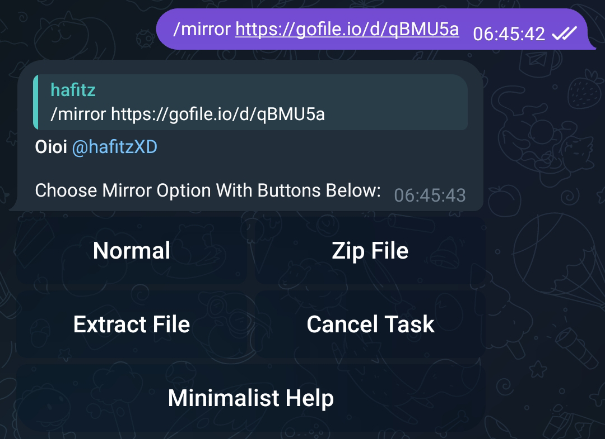

## Extract password protected files
**NOTE:** Here we have a `.zip` archived file whose password is `Breakdowns`.
- Without replying to link/file:
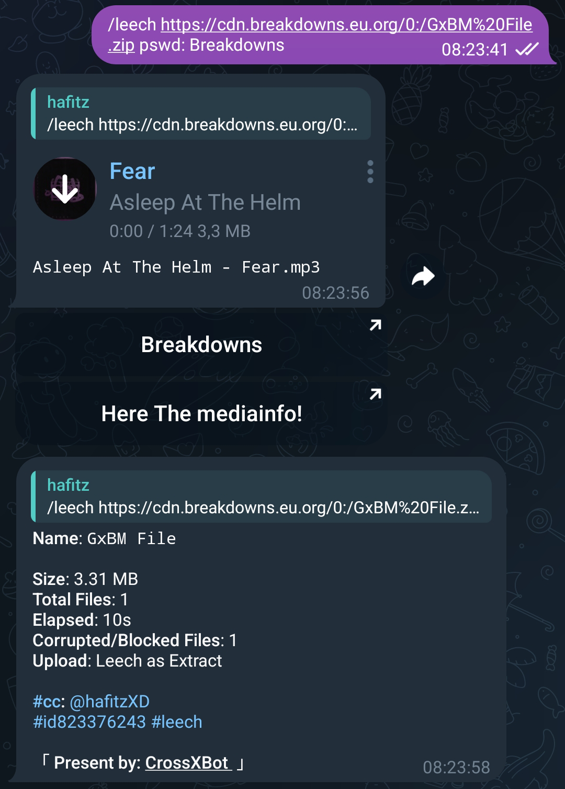
- By replying to link/file:
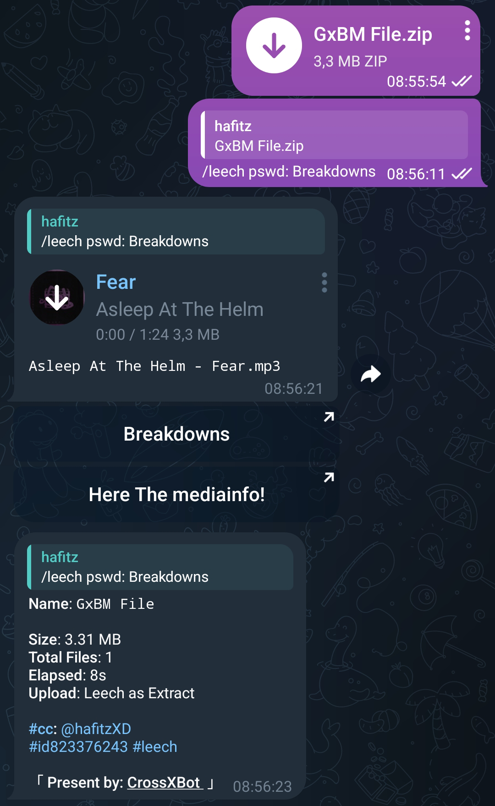

## Set Custom FileName while Mirror or Leech
**NOTE:** Custom Filename is not supported while Mirror Leech and Torrent or Magnet.

To use Custom on File Names you must add arguments `n:`.
- Without replying to link/file:

- By replying to link/file:
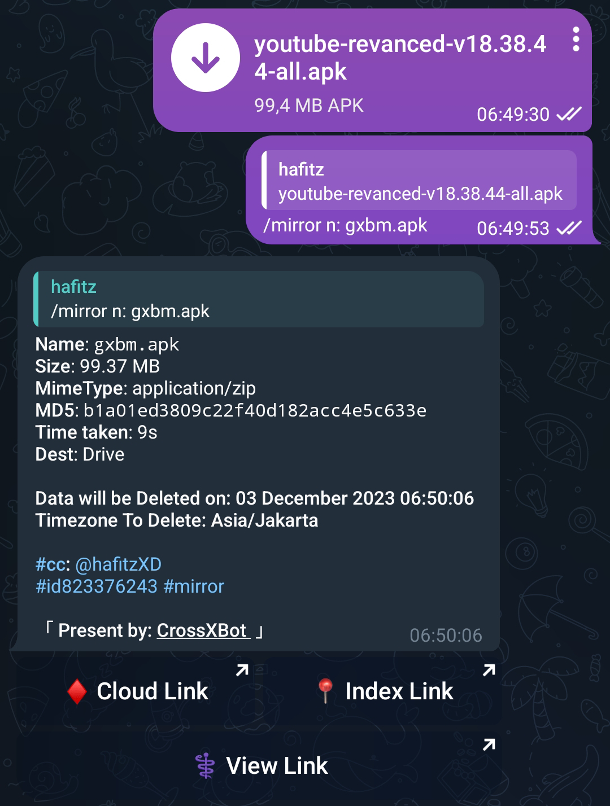

## MultiDownload
**NOTE:** Only works when you reply to the message link.

To use it you need to increase the number of your links after command. Example here I have 2 links.
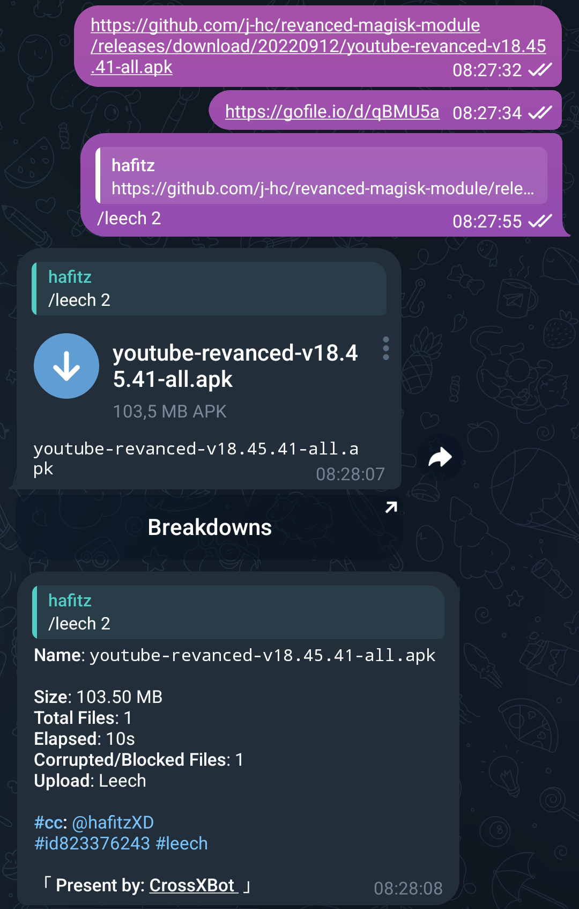
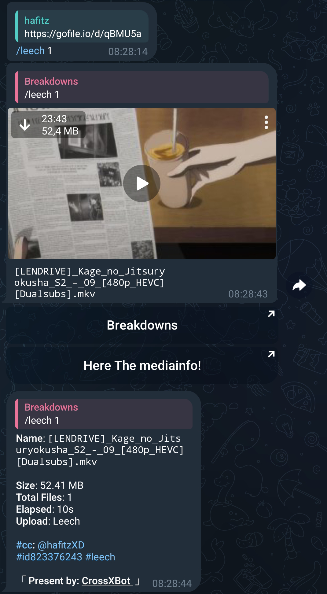

## BulkDownload (Download in large quantities at once)
**NOTE:** Only works when you reply to the message link.

For Bulk Download you must add argument `b` after command. And for specific Bulk download use `:` after `b` without spaces. 
**e.g:** `b:0:7` (starts from 0 ended to 7 on your Bulk) default starts is zero (first link).
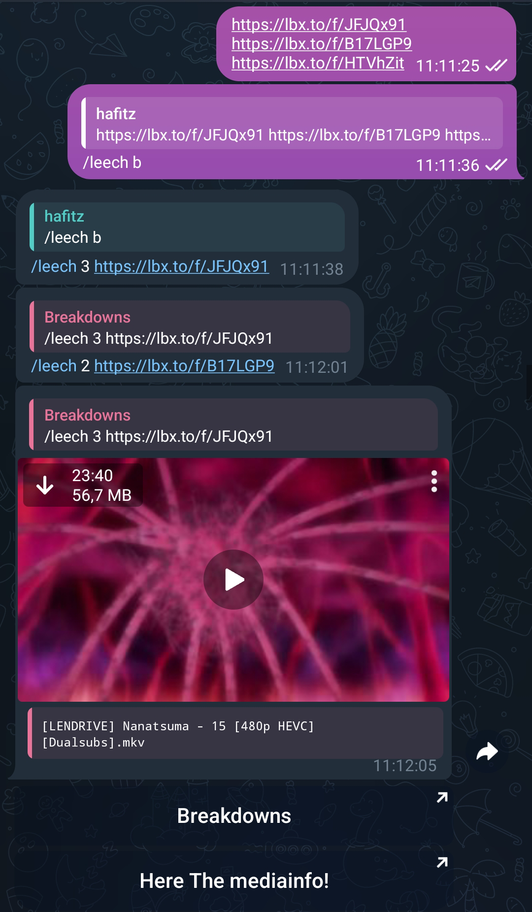

## Mirror in same Directory
**NOTE:** `m:` argument with folder name must be without spaces. Same directory will be useful for Extracting split files. Combine this argument with Multi or BulkDownload.
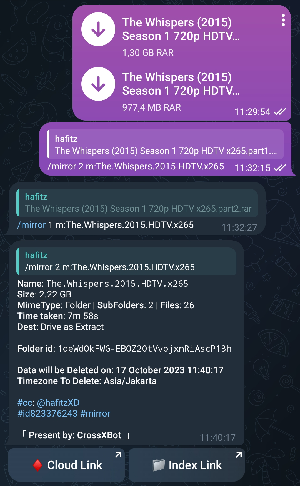

## Select files on Torrent
To select files in Torrent before downloading you need add `s` argument after command.
- Press **Pincode** button to get the Pin Code.
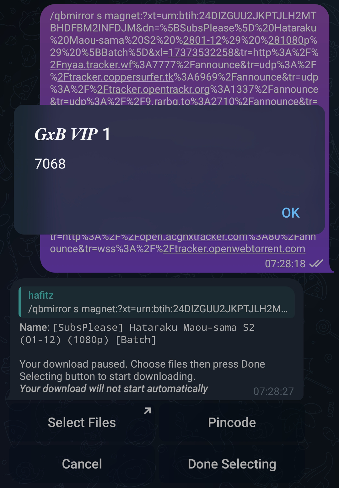
- Press **Select Files** button then you will be directed to the Web, after that enter Pin Code you got, then press **Submit** button.
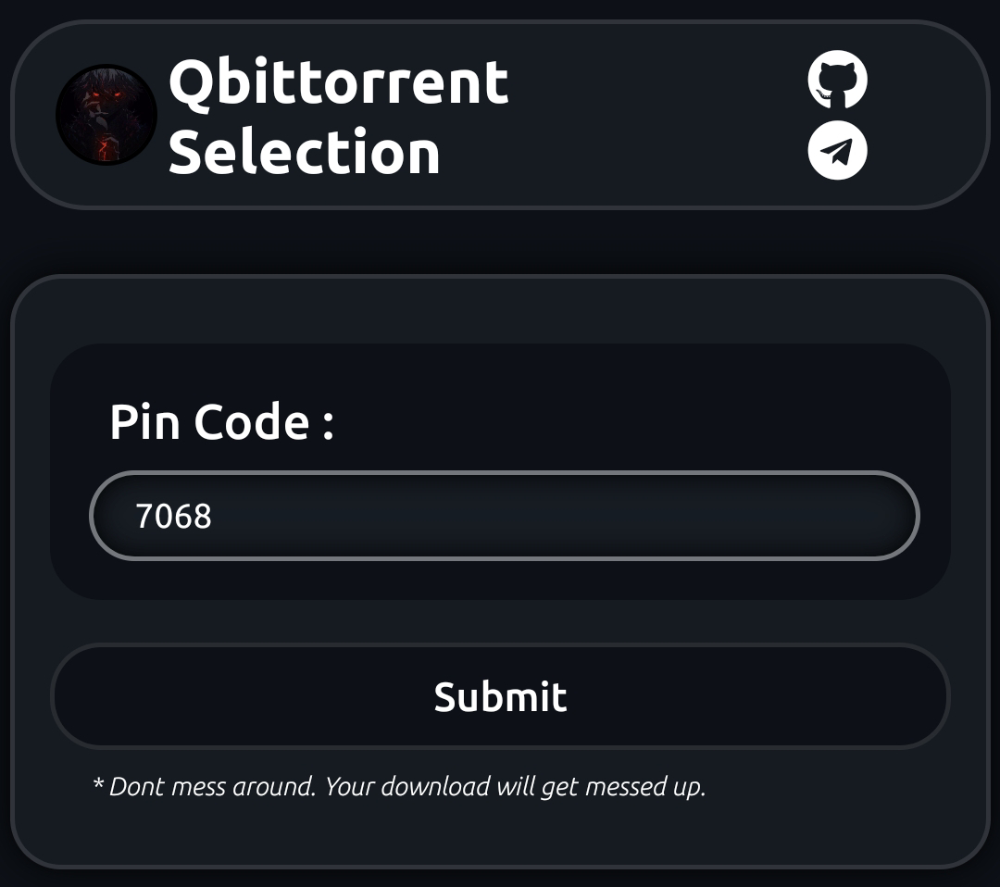
- Select file you want to download, then press **Kirim/Send** button.
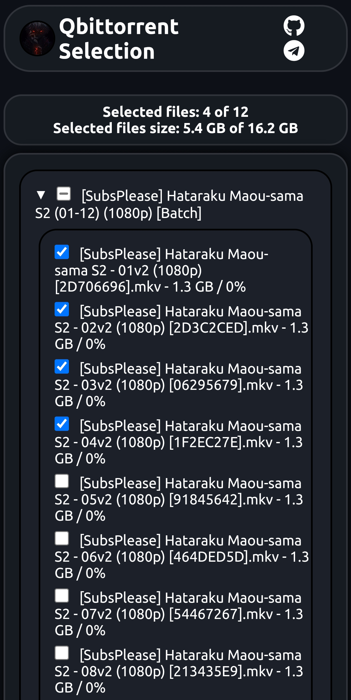
- Done!
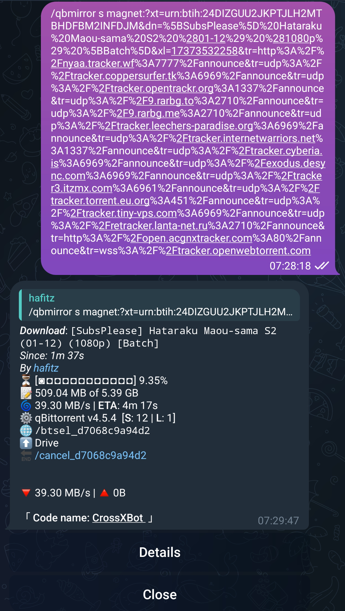

## Seeding Task
To use Seeding feature you need to add `d` argument after command, For specific ratio is `d:1.0`, For specific ratio and time `d:1.0:10`, You can add only time too > `d::10` on minutes.
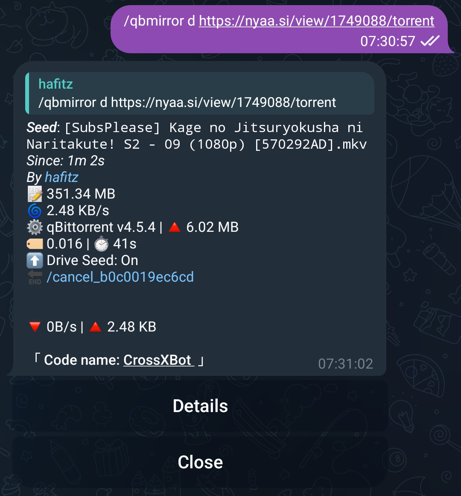
