+++
author = "Breakdowns"
title = "Mirror & Leech"
date = "2023-10-13"
description = "Cara menggunakan beberapa fitur Mirror dan Leech"
categories = [
    "Tutorial"
]
tags = [
    "Mirror Bot"
]
image = "banner.jpg"
+++

---
title: Gabung GxBM
description: GxBM adalah layanan Grup Telegram Mirror/Leech VIP yang berdiri sejak 2022
date: '2023-10-13'
image: banner.jpg
aliases:
  - about-us
  - join-us
  - contact
license: Licensed under CC BY-NC-SA 4.0
lastmod: '2023-12-12'
menu:
    main: 
        weight: -90
        params:
            icon: user-plus

links:
  - title: Aziz
    description: https://t.me/nousernametag
    website: https://t.me/nousernametag
    image: https://cdn5.cdn-telegram.org/file/KsyyL_J4GgbzbOqAbKrPFxwhp-eGREkD7lH8MdzcueHnFkyEX-sR0bdWbEPQx599W3b09AEDWIxDFHB41pJObFpMtVC4gleEXHhnz6zbV1TRtr8p2gRbkQVoMWNZYyy6syUMc3IvbQ74TEXioWWV2Aq8a1RQM00u36M4mO6mZ3tAcTdjfXoDsWtpuSsO_M8CpnUDVHf1uH909fjmqOjVZRjpE1ky0WQSP7Zxwq0EEPvsYN2hl2SmWR4Zkw5eDVOZ7rJ8-S3xlFoOASnd7FB9r6TJ2i36R1-pfKMoKmMh7aBZxRa-ThT--QXwUwKWz6xogfcQY9KTTRnWsVXZOVCcYg.jpg
  - title: Fajar
    description: https://t.me/jar7447
    website: https://t.me/jar7447
    image: https://cdn5.cdn-telegram.org/file/uVUPovJytVvzZJaGnSOEAYfHrMbr_tmVQUoITqbB9rKvBJxbxHWJirwnZhEoug3MD4NsAqCTqB-Gnzbc709jz1zy6V97m7SPzRfdtjQ9ZRhCrOAfMDXwH0zURoRmFHDw942EvfMlX-kTFQhTiDm9LRGDRjjRbkOqJTBDuy7URJ6Y-DJ_8GcB9sRV0t5l4UPs3m7ojCzxXwR36lL36910FZC-mDliBup_nRPRZVV9c-ifSg9yXJThyFZbedcWEZ4Xer0Z-7Pktfa0GMkkw2foMt7C6Z0xs9fUtJKsovyj1fro_DtVH-cQu2R3sST3OITVeBa0AK6q9wm76y-dIE_KKg.jpg
  - title: Hafitz
    description: https://t.me/hafitzXD
    website: https://t.me/hafitzXD
    image: https://cdn5.cdn-telegram.org/file/ZnFQMU93XdfSznxayZI5DKtPfrJYiBMZeUd1cJjbKjvyyjKZ43b3bt9UcHQZW_ELKJIwxYVxiZl5XoSx8TIXL3OuJMViHKNVfKsbQIjwnHGy60RAnMu6hAMyXgg6BtPU63TjHM18D9rpA-wI-IVqK0QKb-yDzzClbksVKgH5PI2FGLlLpux_30dI9rXnss_oD3u2HaSgTddOx2D2DkeseNUduxTV3M3KCYui3JsfFVeyr4XE0udDPklMmI0ZqLulU-V1bCv7kfiNM-V3cfBJLGC6ocnUhiuO3dpdGSEVVMMfskjJylsJX_5ecX4Sx3BbLdiaRXpQe5QRmOsBRTLIkQ.jpg

comments: false
---

## Mengestrak dan Pengarsipan
Untuk Mengestrak atau Mengarsipkan, Anda hanya perlu mengirim perintah Mirror atau Leech, Lalu akan muncul beberapa opsi seperti gambar di bawah.
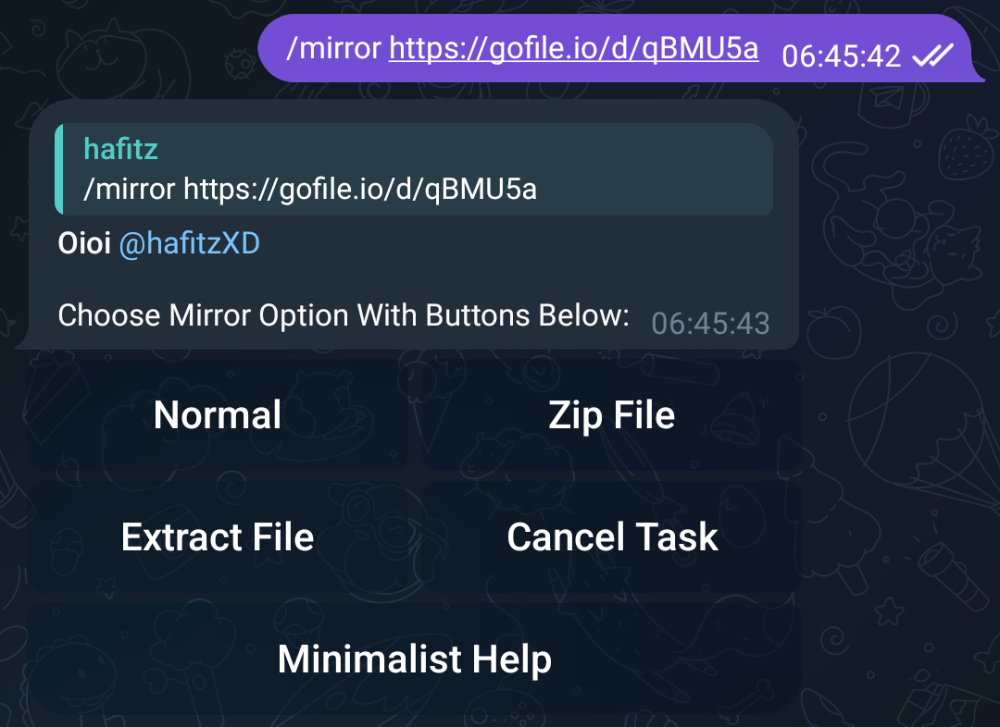

## Mengekstrak file yang dilindungi kata sandi
**NOTE:** Di sini kita memiliki File Arsip `.zip` yang kata sandinya adalah `Breakdowns`.
- Tanpa membalas link/file:
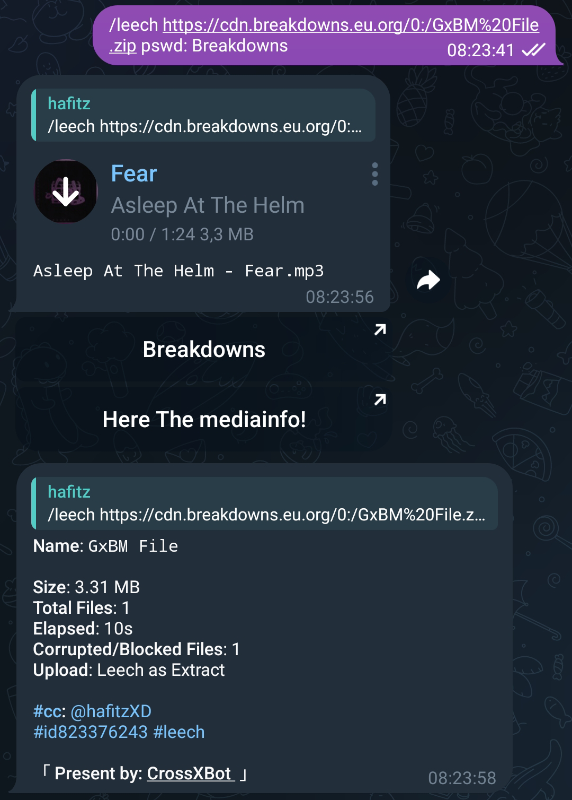
- Dengan membalas link/file:
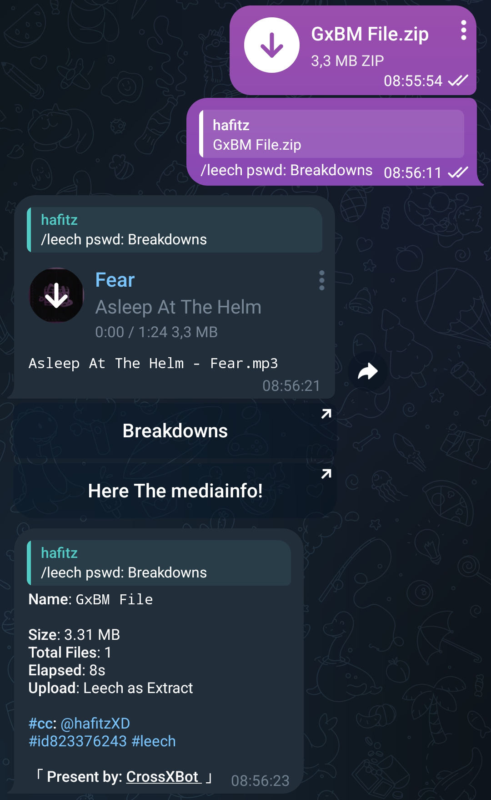

## Menambah Kustom NamaFile saat Mirror atau Leech
**NOTE:** Kustom NamaFile tidak mendukung saat Mirror dan Leech Torrent atau Magnet.

Untuk menggunakan Kustom pada NamaFile Anda harus menambah argumen `n:`.
- Tanpa membalas link/file:
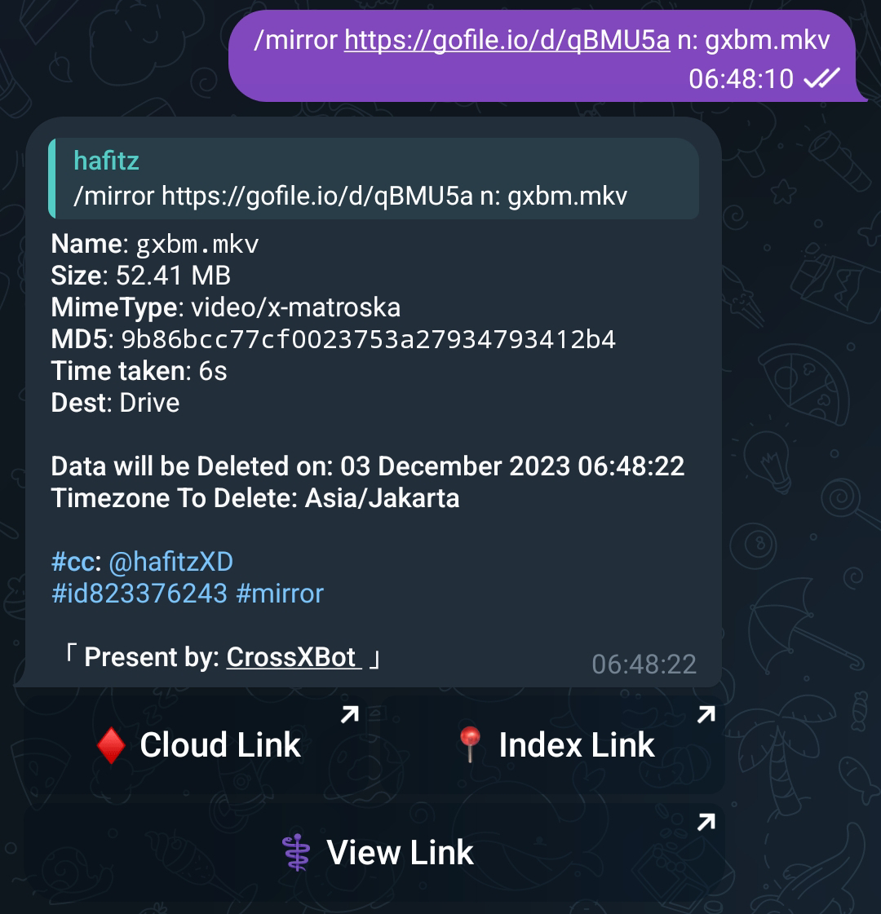
- Dengan membalas link/file:
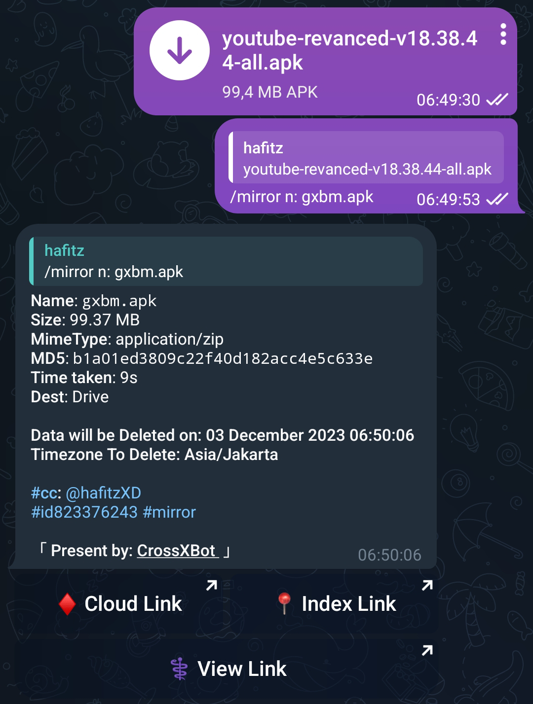

## MultiDownload
**NOTE:** Hanya bekerja saat Anda membalas pesan linknya.

Untuk menggunakannya Anda perlu menambah angka jumlah link Anda setelah command. Contoh di sini saya memiliki 2 link.
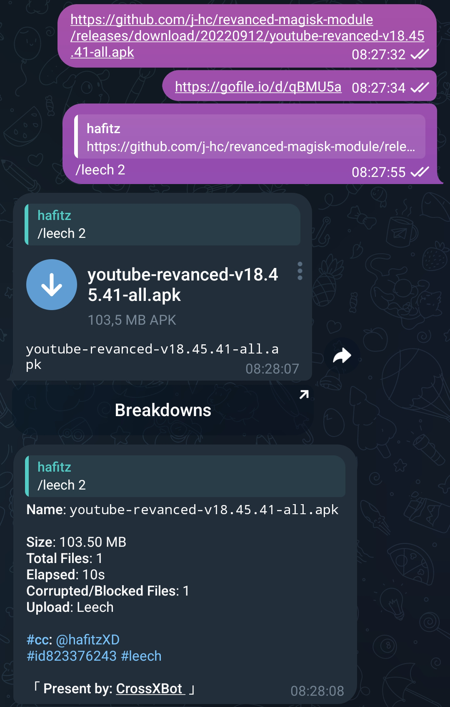
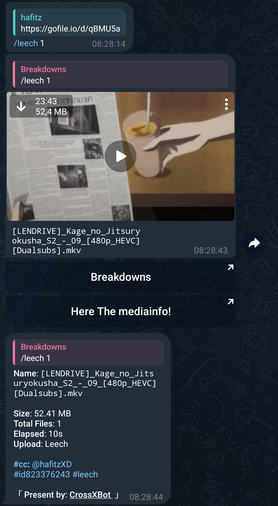

## BulkDownload (Download dalam jumlah sekaligus banyak)
**NOTE:** Hanya bekerja saat Anda membalas pesan linknya.

Untuk download dalam jumlah besar Anda harus menambahkan argumen `b` setelah perintah. Dan untuk download dalam jumlah tertentu, gunakan `:` setelah `b` tanpa spasi. 
**Misalnya:** `b:0:7` (dimulai dari 0 berakhir hingga 7 secara massal) awal default adalah nol (tautan pertama).
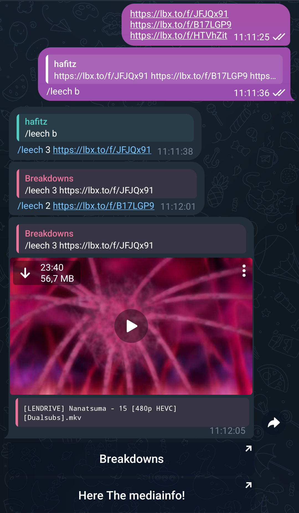

## Mirror di Direktori yang sama
**NOTE:** Argumen `m:` dengan nama folder harus tanpa spasi. 
Direktori yang sama akan berguna untuk Mengekstrak file yang dipisah. 
Gabungkan argumen ini dengan Multi atau BulkDownload.
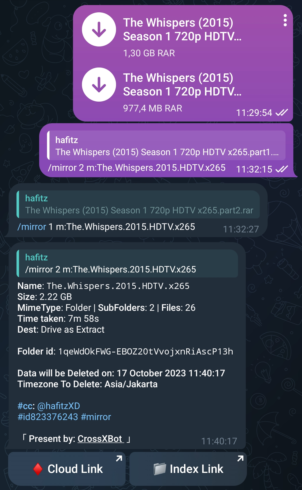

## Memilih file pada Torrent
Untuk memilih file pada Torrent sebelum download Anda perlu menambahkan argumen `s` setelah command.
- Tekan tombol **Pincode** untuk mendapatkan Kode Pin.
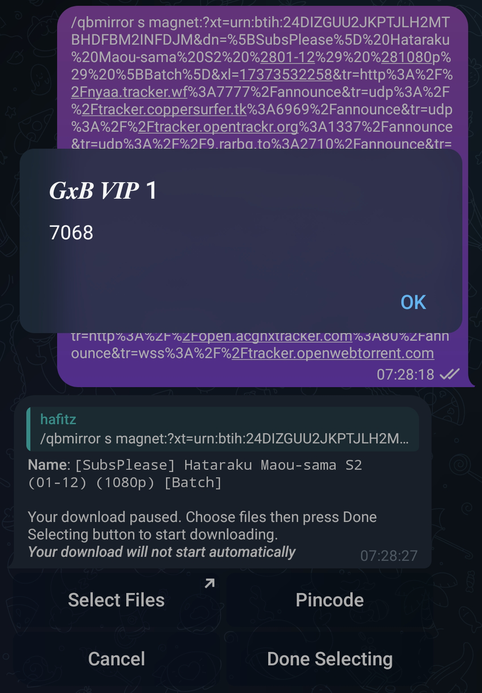
- Tekan tombol **Select Files** lalu akan di arahkan ke Web, setelah itu masukkan Kode Pin yang Anda dapatkan, lalu tekan tombol **Submit**.
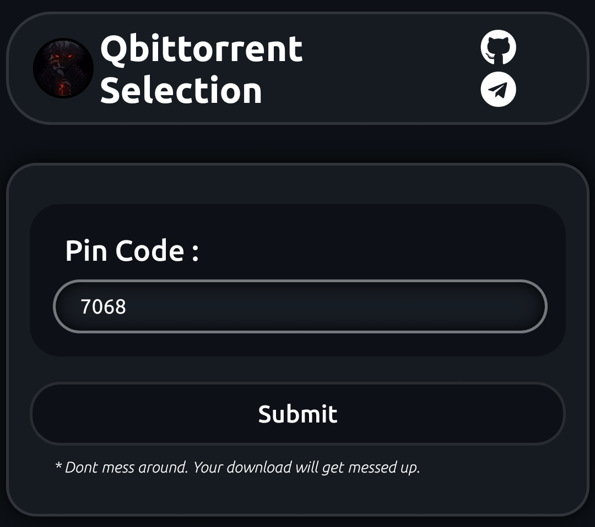
- Pilih file yang ingin Anda download, lalu tekan tombol **Kirim/Send**.
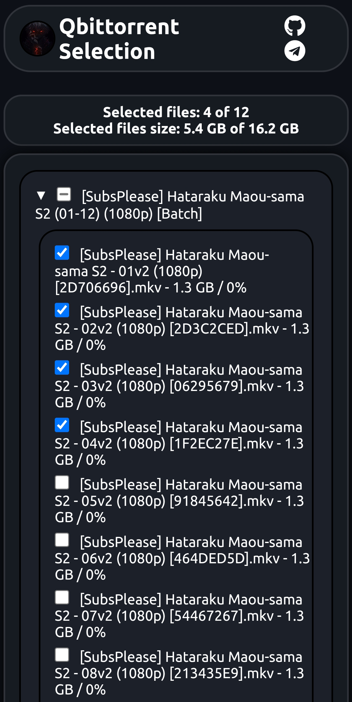
- Selesai!
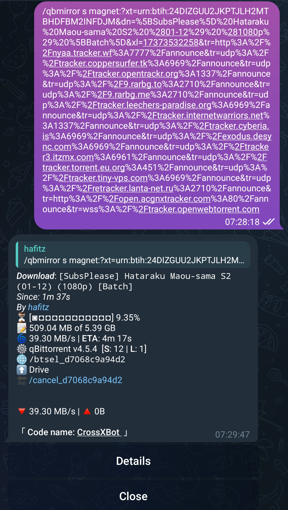

## Tugas Seeding
Untuk menggunakan fitur Seeding Anda perlu menambahkan argumen `d` setelah command, Untuk rasio spesifik adalah `d:1.0`, Untuk rasio dan waktu tertentu `d:1.0:10`, Anda juga hanya dapat menambahkan waktu > `d::10` pada menit.
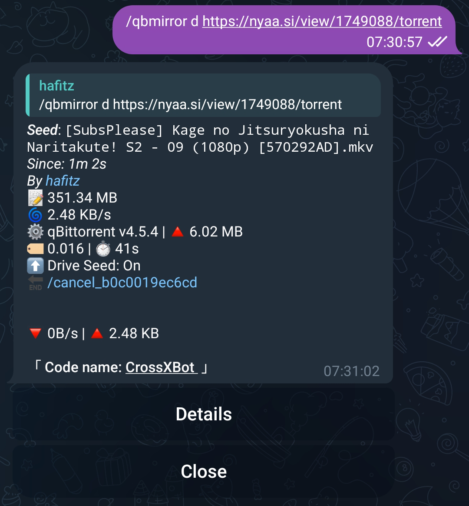
