+++
author = "Breakdowns"
title = "Rclone"
date = "2023-11-02"
description = "Cara menggunakan fitur Rclone"
categories = [
    "Tutorial"
]
tags = [
    "Mirror Bot"
]
image = "banner.jpg"
+++

## Menginstal Rclone
Anda harus mendownload dan menginstall Aplikasi [Termux](https://github.com/termux/termux-app/releases). Setelah itu jalankan perintah `pkg install rclone` untuk menginstall Rclone.

## Generate file `rclone.conf`
**NOTE:** Setiap Cloud mungkin sedikit berbeda cara generatenya, Jadi silahkan ikuti instruksinya.
- Jalankan perintah `rclone config` untuk membuka menu lalu ketik `n` dan silahkan masukkan nama untuk Remote Baru. **NOTE:** Jangan tambahkan Spasi saat menambahkan nama untuk Remote Baru.
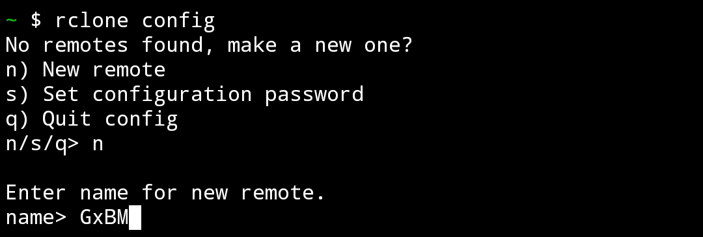
- Pilih Cloud dengan memasukkan nomor. **NOTE:** Di sini Saya memilih Mega dengan nomor 31.
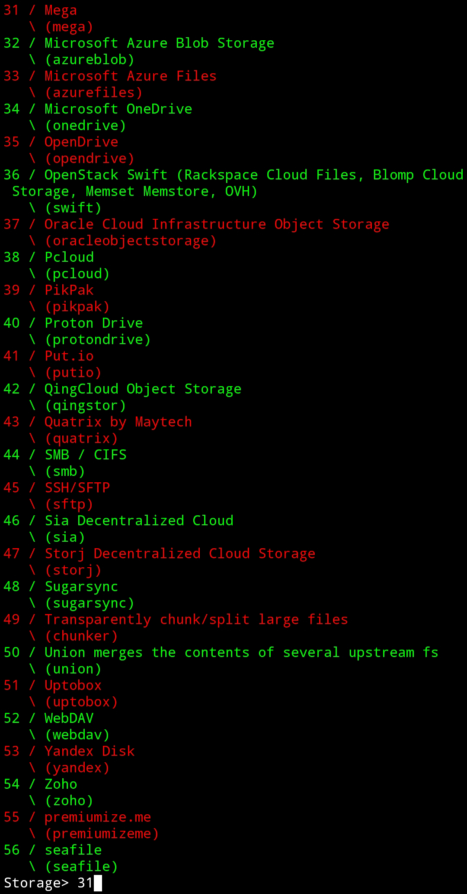
- Masukkan Email Mega Anda, Lalu ketik `y` dan masukkan Password Mega Anda.
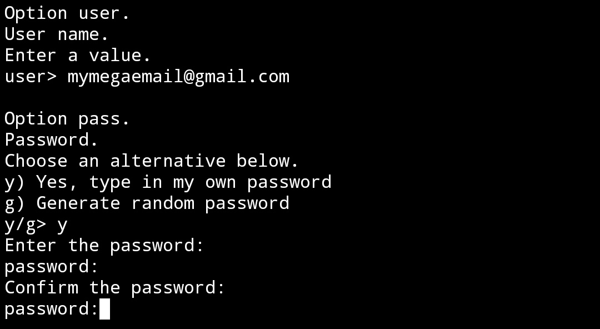
- Setelah itu ketik `n` lalu `y` lalu ketik `q` untuk keluar.
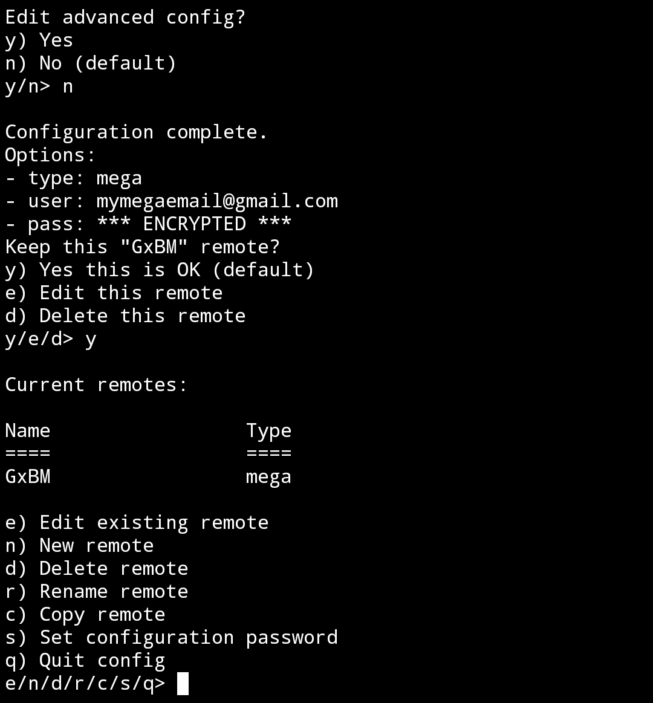
- Untuk mengcopy file `rclone.conf` ke penyimpanan internal, Gunakan perintah `rclone config file` lalu `cp /data/data/com.termux/files/home/.config/rclone/rclone.conf /sdcard`.

## Setup fitur Rclone pada Bot
**NOTE:** Fitur Rclone tidak aktif secara default, Jadi Anda harus kontak Admin untuk mengaktifkannya untuk Anda.
- Silahkan ke User Setting, Lalu klik tombol Rclone.
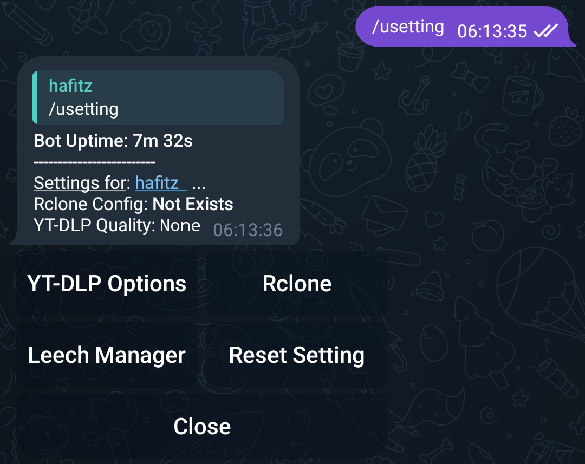
- Lalu upload file `rclone.conf` Anda.
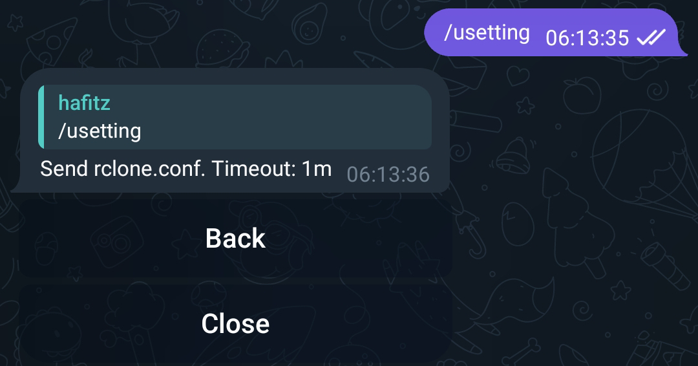

## Cara upload menggunakan Rclone
**NOTE:** Hanya bekerja saat Anda membalas pesan linknya.
- Untuk menggunakan Rclone, Anda harus menambah argumen `up: rcl`.
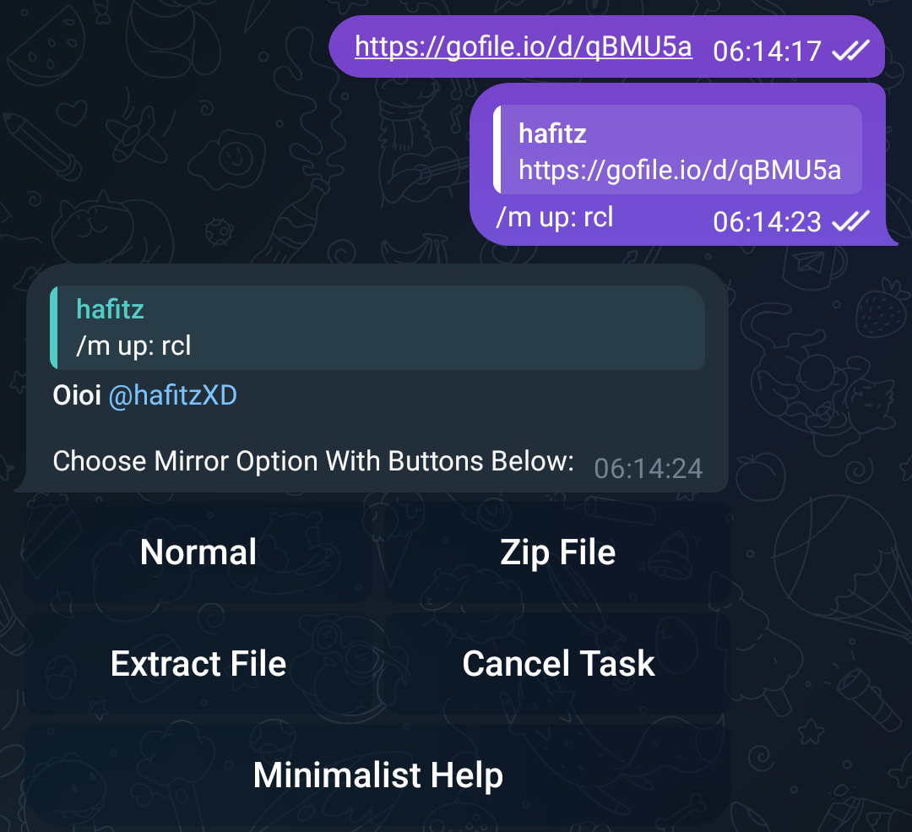
- Pilih Cloud Anda. **NOTE:** di sini Saya memilih Mega.
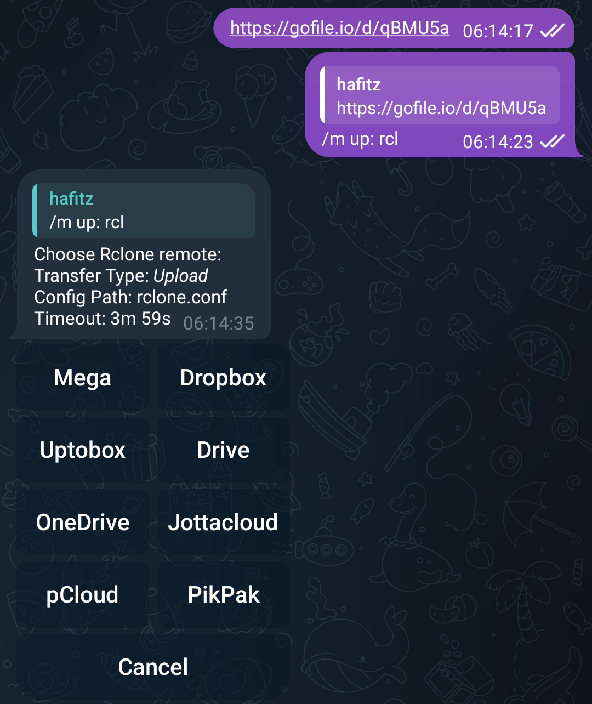
- Lalu pilih tujuan upload. **NOTE:** Karena Saya tidak memiliki folder pada Mega Saya, Jadi langsung klik **Choose Current Path**.
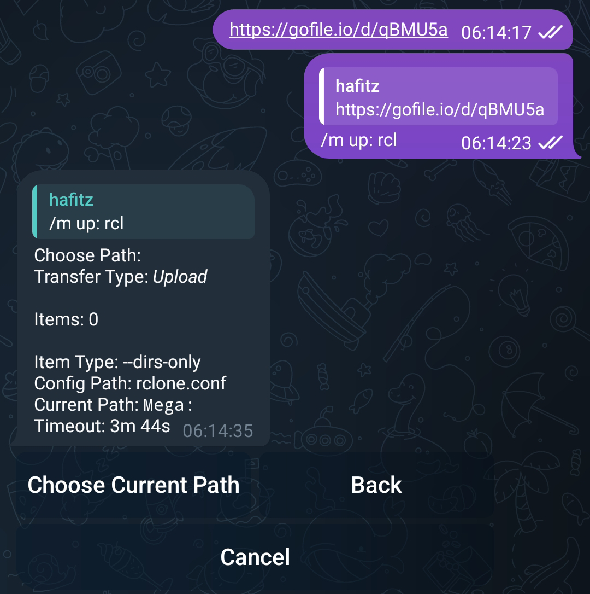
- Done! File Saya terupload ke Mega.
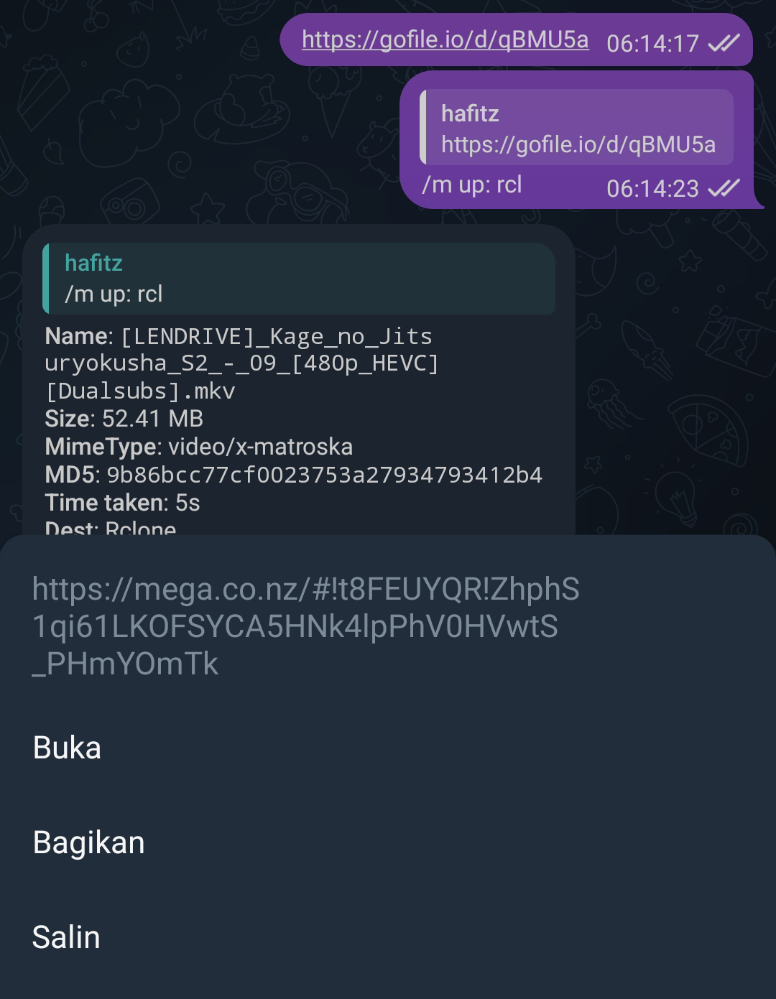

## Menghapus/Mengganti Akun Cloud
Jalankan perintah `rclone config` untuk membuka menu lalu ketik `d` dan masukkan nomor cloud Anda.
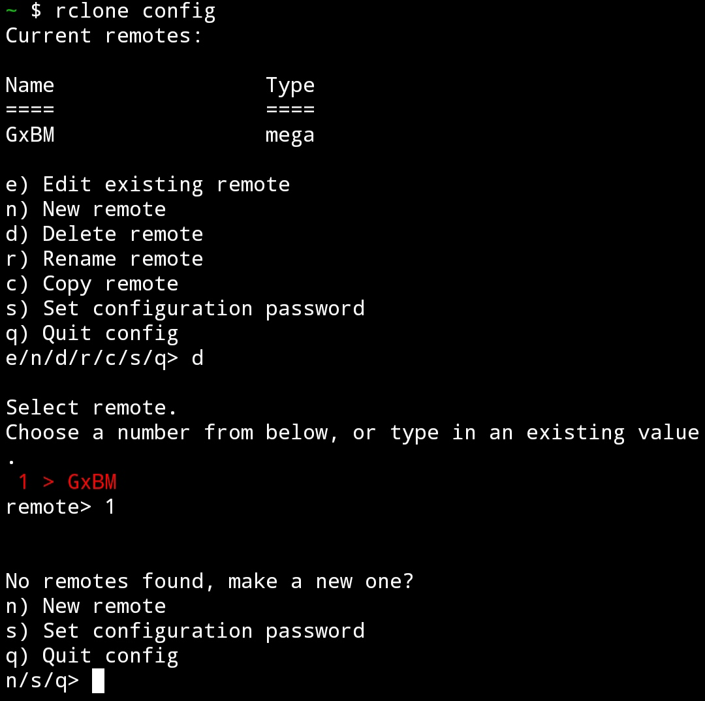
Setelah itu silahkan ikuti cara di atas jika Anda ingin mengganti atau menambahkan ulang akun cloud Anda.
