+++
author = "Breakdowns"
title = "User Setting"
date = "2023-12-12"
description = "How to use some User Setting feature"
categories = [
    "Tutorial"
]
tags = [
    "Mirror Bot"
]
image = "banner.jpg"
+++

## 1. YT-DLP Options
- **Options Note:** Add `^` before integer or float, some values must be numeric and some string.
Like `playlist_items:10` works with string, so no need to add `^` before the number but `playlistend` works only with integer so you must add `^` before the number like example above.
You can add tuple and dict also. Use double quotes inside dict.
- **bol-meledag** is Custom FFMPEG.
- You can always add video quality from YT-DLP api options.
- **Don't add file extension while rename using** `n:`.
- args(Rename, Password) must be added randomly positioned after link if along with commands and any args
- When you uses command by replying to msg/link. don't add any arguments on your link. input args by which as you start the command by replying to msg/links.
- **Options Example:** `opt: embedsubtitles:true|writesubtitles:true|allsubtitles:true`
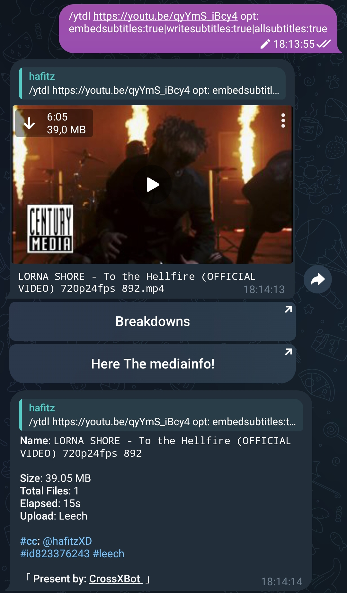

Check all YT-DLP api options from this [FILE](https://github.com/yt-dlp/yt-dlp/blob/master/yt_dlp/YoutubeDL.py#L184) or use the script below to convert cli arguments to api options.

```python
import sys

import yt_dlp

NO_DIFFERENCE = object()


def deep_diff(a, b):
    if not isinstance(b, type(a)):
        return b

    if isinstance(a, dict):
        assert isinstance(b, dict)
        result = {}
        for key, value in b.items():
            difference = deep_diff(a.get(key), value)
            if difference is not NO_DIFFERENCE:
                result[key] = difference

        return result if result else NO_DIFFERENCE

    if isinstance(a, (list, tuple)):
        assert isinstance(b, (list, tuple))
        result = [
            b_val for b_val in b
            if not any(deep_diff(a_val, b_val) is NO_DIFFERENCE for a_val in a)
        ]

        return type(a)(result) if result else NO_DIFFERENCE

    return b if a != b else NO_DIFFERENCE


def cli_to_api(options):
    default_options = yt_dlp.parse_options([]).ydl_opts
    parsed_options = yt_dlp.parse_options(options).ydl_opts

    diff = deep_diff(default_options, parsed_options)
    return {} if diff is NO_DIFFERENCE else diff

import pprint

try:
    pprint.pprint(cli_to_api(sys.argv[1:]))
except Exception as error:
    print(error)
    sys.exit(1)

sys.exit(0)
```

## 2. Rclone
**NOTE:** Rclone feature is not enabled by default, So you have to contact Admin to enable it for you.

For how to use the Rclone feature, you can see the article about Rclone [Here](/en/p/rclone).

## 3. Leech Manager
### Send As Document
To send files as Documents.


### Thumbnail
To add Thumbnails on video files.
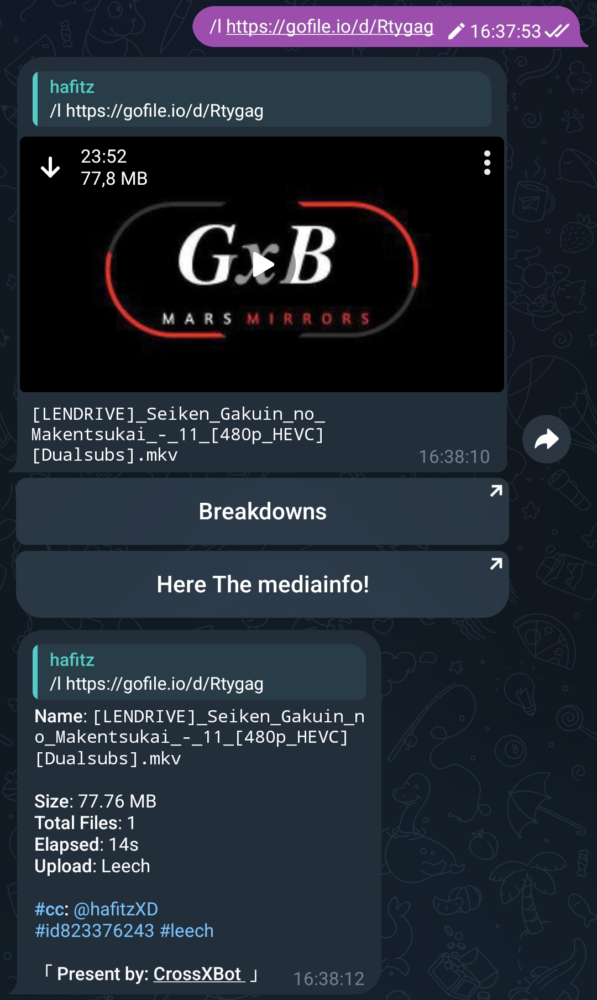

### Leech Splits
To split files.
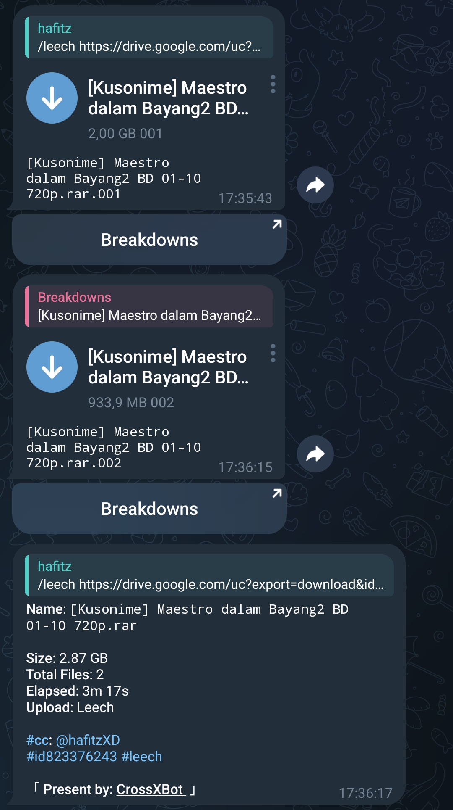

### Leech Prefix
To add prefix on file name.
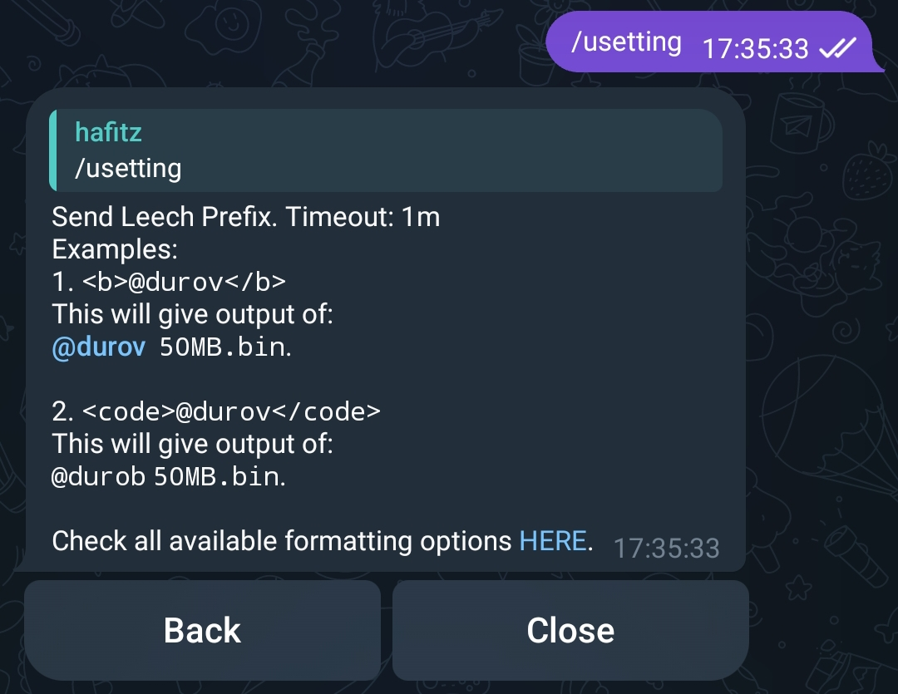
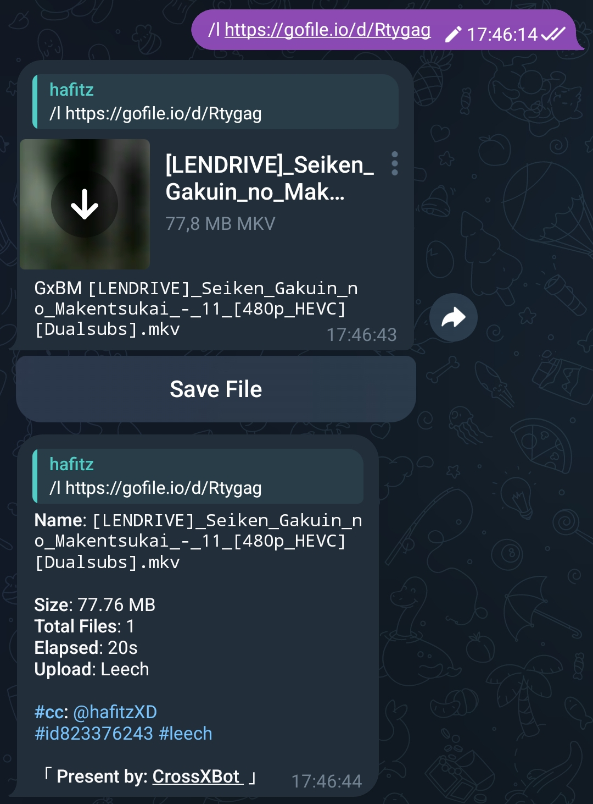

### Leech Suffix
To customize captions on files.
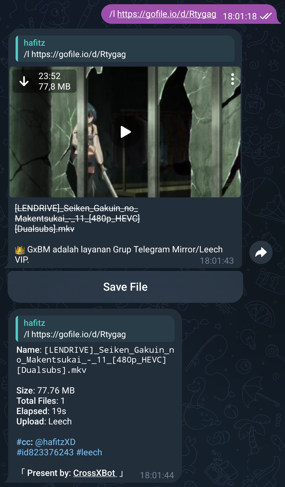

### Mediainfo
To enable Mediainfo button and create your file info.
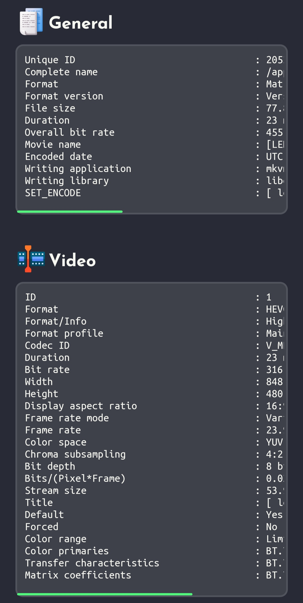

### Media Spoiler
To hide spoiler on media.


### Html Style
To customize caption style.
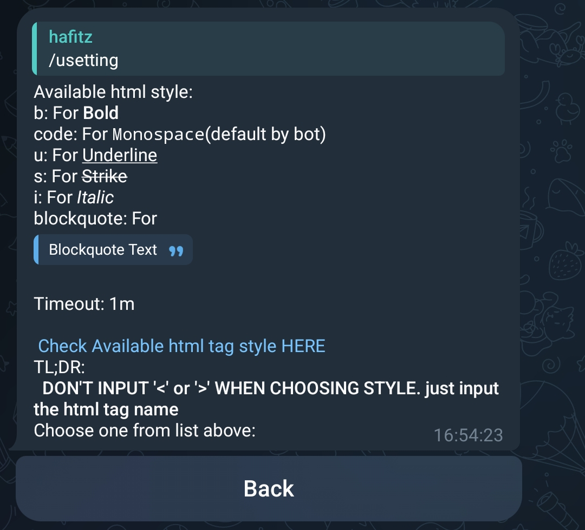
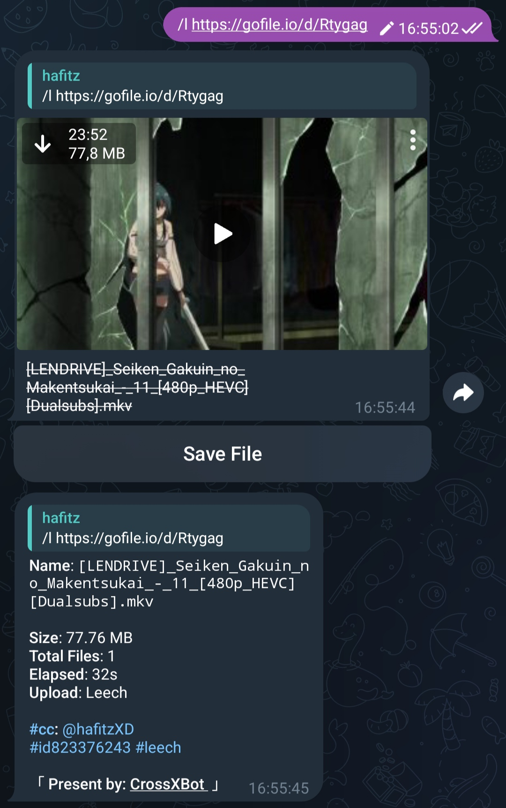

### Saved Button
To enable Save File button and save the file in PM Bot.
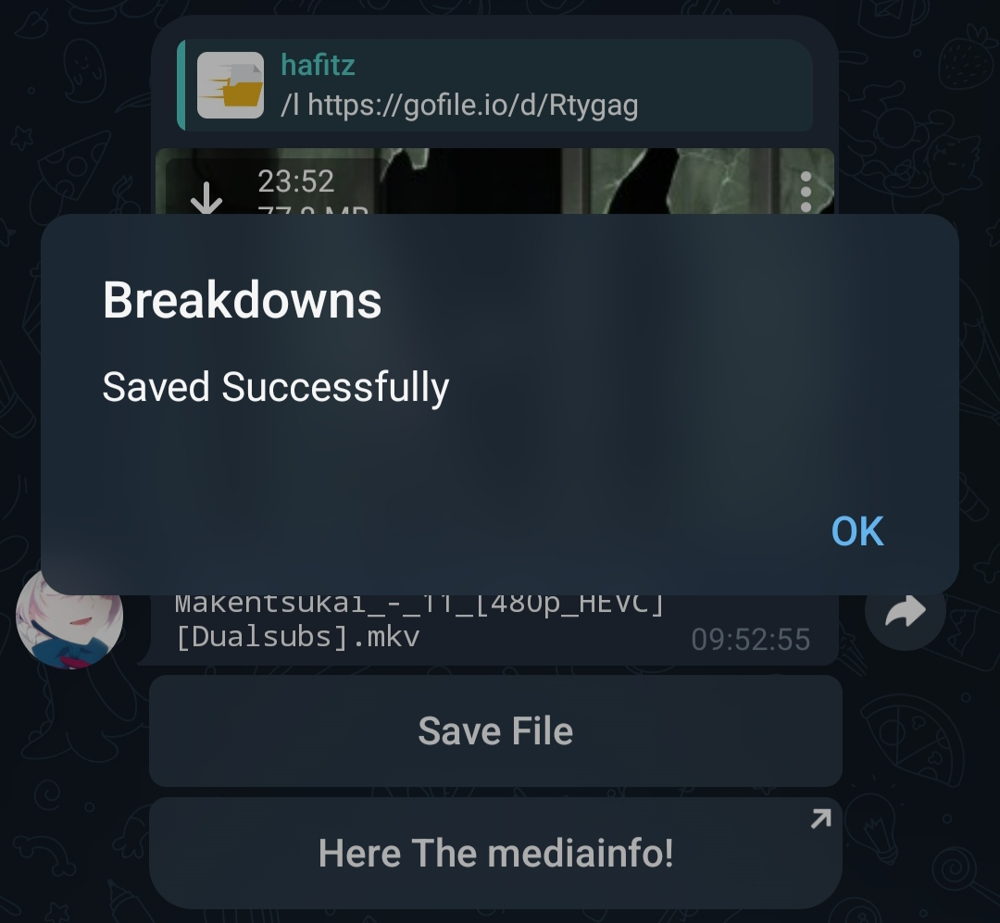
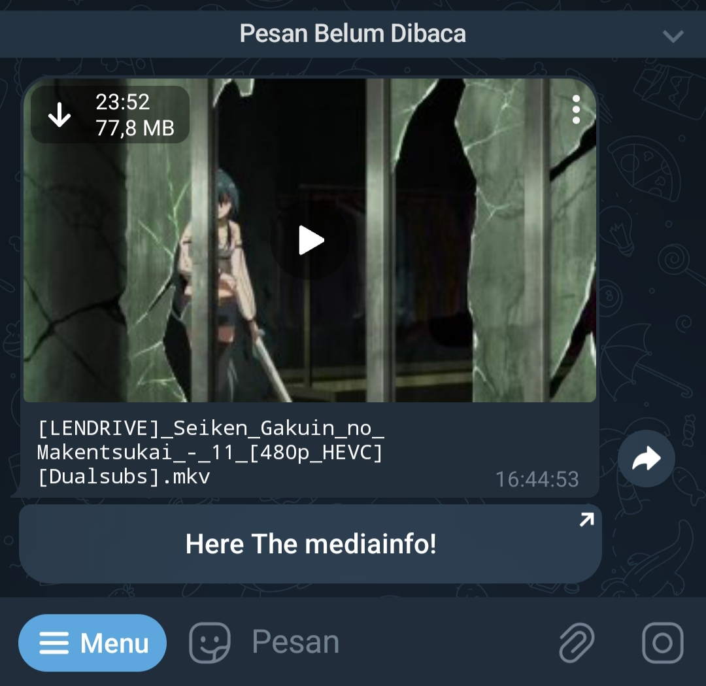
