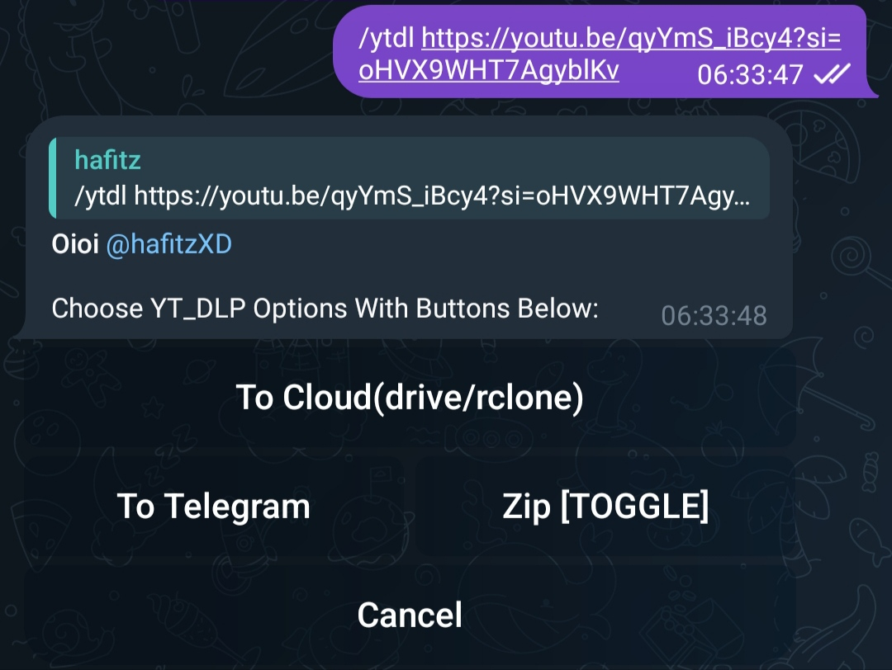
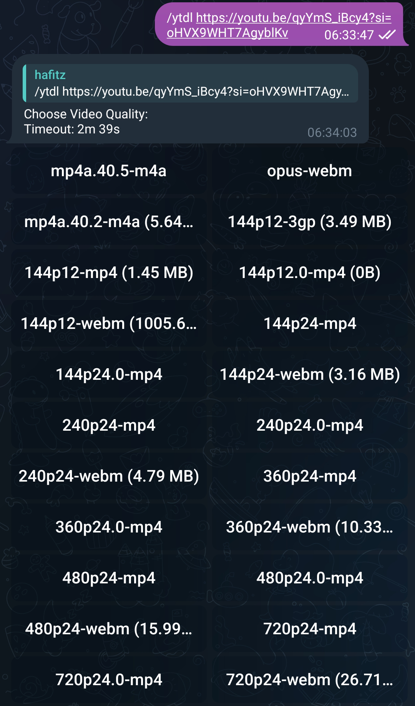
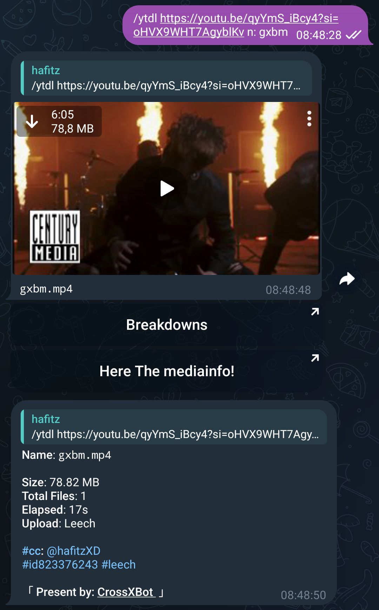
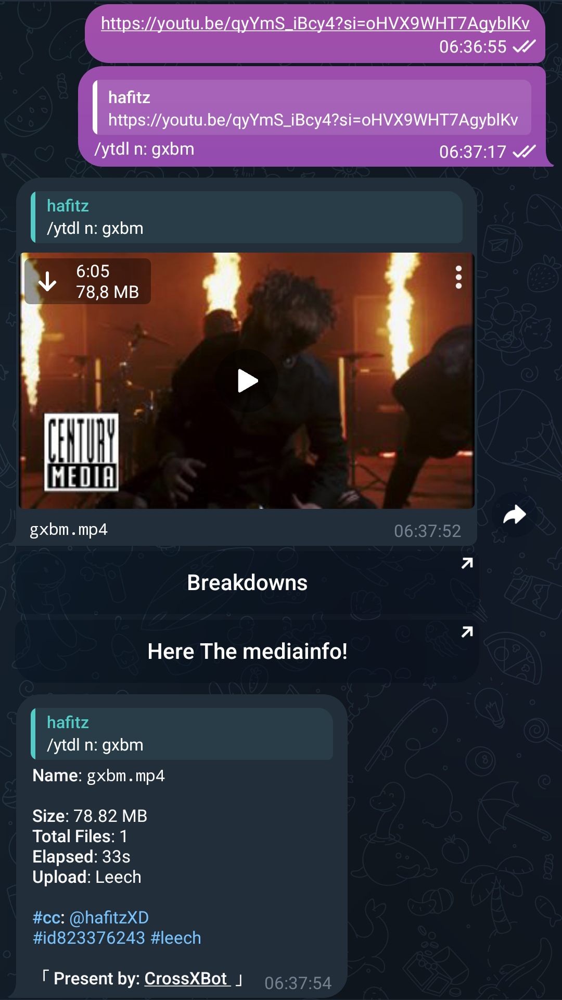

+++
author = "Breakdowns"
title = "YT-DLP"
date = "2023-10-14"
description = "How to use some YT-DLP features"
categories = [
    "Tutorial"
]
tags = [
    "Mirror Bot"
]
image = "banner.jpg"
+++

## NOTE:
You can see supported sites [Here](https://github.com/yt-dlp/yt-dlp/blob/master/supportedsites.md).

## Select Video or Audio quality
Select the download destination (To Cloud or To Telegram), Then just press the button for quality you want.

## Set Custom FileName while using YT-DLP
**NOTE:** No need to provide additional file formats.
- Without replying to link:

- By replying to link:

